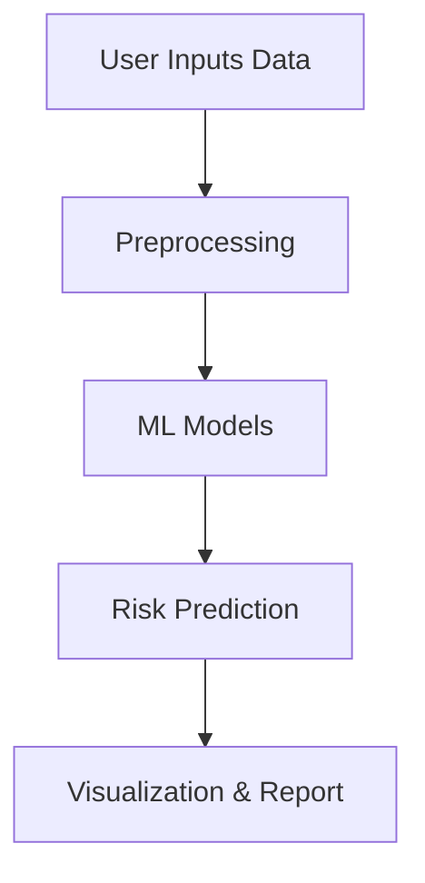

# 🩺 Hypertension Prediction App

\
\
\


## 📌 Overview

Hypertension (high blood pressure) is a leading risk factor for heart
disease, stroke, and kidney failure worldwide.\
The **Hypertension Prediction App** leverages **machine learning
models** to predict whether an individual is at risk of hypertension
based on their demographic, lifestyle, and clinical data.

This project aims to support **early detection** and **preventive
healthcare** by providing clinicians and individuals with a simple,
interactive tool.

------------------------------------------------------------------------

## 🎯 Objectives

1.  **Develop predictive models** (Logistic Regression, Random Forest,
    SVM, etc.) for hypertension risk.\
2.  **Identify key predictors** such as age, BMI, smoking, alcohol use,
    and physical activity.\
3.  **Deploy a user-friendly app** using **Streamlit** for real-time
    predictions.\
4.  **Promote early detection** to reduce long-term complications of
    hypertension.

------------------------------------------------------------------------

## ✨ Features

✅ Upload patient data (CSV) or input manually\
✅ Predict hypertension risk with multiple ML models\
✅ Interactive visualizations for risk factors\
✅ Model performance metrics (Accuracy, F1, ROC Curve)\
✅ Clean, responsive **Streamlit web interface**

------------------------------------------------------------------------

## 📂 Project Structure

Hypertension-Prediction-App/ │── data/ \# Dataset (not included for
privacy) │── notebooks/ \# Jupyter notebooks for EDA & model training
│── app.py \# Main Streamlit app │── models/ \# Saved trained models │──
requirements.txt \# Project dependencies │── README.md \# Documentation
│── assets/ \# Images/screenshots for README

------------------------------------------------------------------------

## ⚙️ Installation & Setup

Clone the repository:

``` bash
git clone https://github.com/your-username/Hypertension-Prediction-App.git
cd Hypertension-Prediction-App
```

Create and activate a virtual environment:

``` bash
python -m venv venv
source venv/bin/activate   # For Linux/Mac
venv\Scripts\activate      # For Windows
```

Install dependencies:

``` bash
pip install -r requirements.txt
```

Run the app:

``` bash
streamlit run app.py
```

------------------------------------------------------------------------

## 🧠 Methodology

🔹 **Data Preprocessing**\
- Handle missing values\
- Encode categorical features\
- Standardize numerical variables

🔹 **Models Developed**\
- Logistic Regression\
- Random Forest\
- Support Vector Machine (SVM)\
- Naïve Bayes

🔹 **Evaluation Metrics**\
- Accuracy\
- Precision, Recall, F1-score\
- ROC-AUC

🔹 **Key Findings**\
- Age, BMI, smoking status, and family history were the strongest
predictors.\
- Logistic Regression performed best with \~85% accuracy.

------------------------------------------------------------------------

## 📊 App Workflow



------------------------------------------------------------------------

## 📸 Screenshots

Add screenshots of your Streamlit app here.

    assets/
       └── homepage.png
       └── prediction.png
       └── results.png

------------------------------------------------------------------------

## 🤝 Contributing

Contributions are welcome!

1.  Fork this repo\
2.  Create a new branch (`feature-new`)\
3.  Commit your changes\
4.  Submit a pull request

------------------------------------------------------------------------

## 📜 License

This project is licensed under the MIT License. See LICENSE for details.

------------------------------------------------------------------------

## 📬 Contact

👨‍💻 Author: Enoch Bereka\
📧 Email: enochosenwafulah@gmail.com\
🌐 GitHub: your-username\
💼 LinkedIn: your-linkedin
